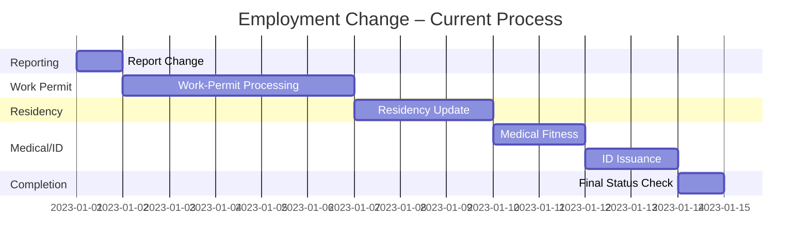

# The Problem

Continuing to manage **employment transitions** in the UAE today requires residents to juggle multiple, loosely‑connected government services:

- Employer processes
- Work‑permit issuance (MOHRE)
- Residency updates (GDRFA‑Dubai)
- Medical fitness certificates
- Identification services

Each service has its own portal, timeline, and status tracking. Residents often:

- Manually check each system for updates
- Experience long, unpredictable waiting periods between dependent steps
- Lack visibility on what action is required next

Continuum does **not** simply expose another portal; it **orchestrates** the entire journey, coordinating dependencies so the resident only deals with a single AI‑driven interaction.

---

## Today’s Fragmented Workflow

*Multiple handoffs, manual status checks, and uncertain waiting times.*

---

### Why Coordination Matters

The core challenge is **dependency management** – a later service cannot start until a prior one finishes. Continuum tracks these dependencies, proactively notifies the resident, and only escalates to a human officer when a government decision is required.
